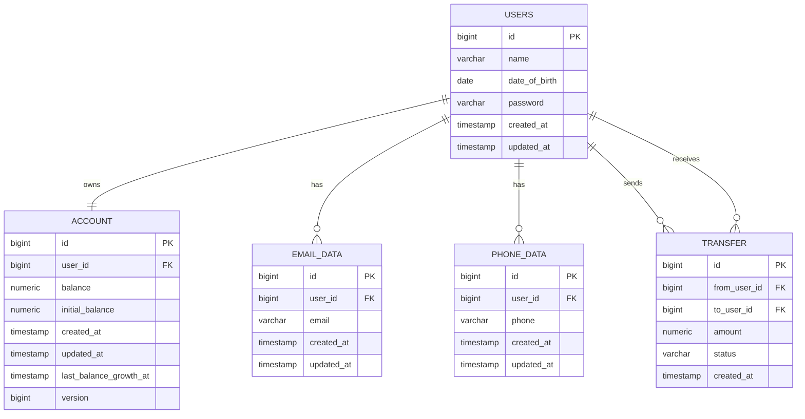

# Secure Bank API

Spring Boot REST API для тестового банковского приложения.

## Локальная база данных

Локальный PostgreSQL можно запустить командой:

```bash
docker compose up -d postgres
```

По умолчанию приложение подключается к базе по адресу:

`jdbc:postgresql://localhost:55432/banking`

Схема базы данных создается через Flyway-миграции:

`src/main/resources/db/migration`

## Схема базы данных



## Таблицы

| Таблица | Назначение |
| --- | --- |
| `users` | Пользователи банка: имя, дата рождения и BCrypt-хеш пароля. |
| `account` | Один счет на пользователя: текущий баланс, начальный баланс и технические поля для конкурентной работы. |
| `email_data` | Email-адреса пользователя. У пользователя может быть несколько email, но минимум один. |
| `phone_data` | Телефоны пользователя. У пользователя может быть несколько телефонов, но минимум один. |
| `transfer` | История денежных переводов между пользователями. |

## Отличия от исходной схемы из ТЗ

В ТЗ разрешено добавлять поля и таблицы, если это необходимо. Базовые таблицы из задания сохранены, но схема расширена техническими полями и таблицей истории переводов.

| Таблица | Добавлено | Зачем |
| --- | --- | --- |
| `users` | Название `users` вместо `user` | `USER` может конфликтовать с SQL-идентификаторами и зарезервированными словами в разных БД, поэтому используется безопасное имя `users`. |
| `users` | `created_at`, `updated_at` | Поля аудита: когда запись создана и когда последний раз обновлялась. |
| `account` | `initial_balance` | Нужен для бизнес-правила роста баланса: баланс увеличивается на 10%, но не выше `207%` от начального депозита. |
| `account` | `version` | Поле для JPA `@Version`. Переводы используют пессимистическую блокировку, но `version` остается полезной дополнительной защитой от конкурентных изменений. |
| `account` | `last_balance_growth_at` | Указатель для планировщика роста баланса. По нему приложение понимает, пора ли начислять следующий 30-секундный шаг. Если аккаунт был заблокирован переводом, он не теряет начисление и догоняется позже. |
| `account` | `created_at`, `updated_at` | Поля аудита для счета и обновлений баланса. |
| `email_data` | `created_at`, `updated_at` | Поля аудита для изменений email. |
| `phone_data` | `created_at`, `updated_at` | Поля аудита для изменений телефона. |
| `transfer` | новая таблица | Нужна для истории банковских переводов: кто отправил, кому отправил, какая сумма, статус и время операции. |

## Ограничения и индексы

Дополнительно добавлены ограничения и индексы, чтобы часть важных правил защищалась не только Java-кодом, но и самой базой данных.

| Ограничение / индекс | Зачем |
| --- | --- |
| `account_balance_non_negative` | Не дает сохранить отрицательный баланс. |
| `account_initial_balance_non_negative` | Не дает сохранить отрицательный начальный депозит. |
| `transfer_amount_positive` | Не дает сохранить перевод с нулевой или отрицательной суммой. |
| `idx_email_data_user_id` | Ускоряет загрузку email пользователя. |
| `idx_phone_data_user_id` | Ускоряет загрузку телефонов пользователя. |
| `idx_transfer_from_user_id` | Ускоряет поиск переводов по отправителю. |
| `idx_transfer_to_user_id` | Ускоряет поиск переводов по получателю. |
| `idx_account_last_balance_growth_at_user_id` | Ускоряет пакетную выборку аккаунтов, которым пора начислить рост баланса. |

## Тестовые данные

Тестовые пользователи добавляются миграцией:

`V2__insert_test_users.sql`

Для всех тестовых пользователей используется пароль:

`password123`

В базе хранится не сам пароль, а BCrypt-хеш.

## О приложении

`Secure Bank API` - это REST API для тестового банковского приложения на Spring Boot.

Приложение моделирует базовые операции обычного пользователя банка:

| Возможность | Описание |
| --- | --- |
| Авторизация | Пользователь получает JWT по email и паролю. |
| Поиск пользователей | Любой авторизованный пользователь может искать других пользователей по имени, дате рождения, email и телефону. |
| Управление email | Пользователь может добавлять, менять и удалять только свои email. Последний email удалить нельзя. |
| Управление телефонами | Пользователь может добавлять, менять и удалять только свои телефоны. Последний телефон удалить нельзя. |
| Перевод денег | Пользователь может перевести деньги другому пользователю. Отправитель всегда берется из JWT, а не из тела запроса. |
| Рост баланса | Раз в 30 секунд баланс аккаунтов увеличивается на 10%, но не выше 207% от начального депозита. |

В системе нет ролей администратора. Все пользователи считаются обычными пользователями.

## Стек

| Технология | Для чего используется |
| --- | --- |
| Java 11 | Основная версия Java для проекта. |
| Spring Boot | Каркас приложения. |
| Spring Web | REST API. |
| Spring Security | JWT-аутентификация и защита endpoints. |
| Spring Data JPA | DAO/repository слой. |
| PostgreSQL | Основная база данных. |
| Flyway | Версионирование схемы БД. |
| Maven | Сборка проекта. |
| Testcontainers | Интеграционные тесты с реальной PostgreSQL. |
| MockMvc | Интеграционные API-тесты без поднятия внешнего HTTP-сервера. |
| Caffeine Cache | Локальное in-memory кэширование. |
| springdoc-openapi | Swagger/OpenAPI документация. |

## Архитектура

Проект разделен на классические слои:

| Слой | Пакет | Ответственность |
| --- | --- | --- |
| API | `controller` | Принимает HTTP-запросы, запускает validation, возвращает DTO. |
| Service | `service`, `service.impl` | Содержит бизнес-логику: переводы, email/phone операции, рост баланса. |
| DAO | `repository` | Работает с базой данных через Spring Data JPA и native SQL там, где нужны блокировки. |
| Entity | `entity` | JPA-сущности, связанные с таблицами БД. |
| Security | `security`, `config` | JWT, security filter, SecurityConfig. |

## Быстрый старт

1. Запустить PostgreSQL:

```bash
docker compose up -d postgres
```

2. Запустить приложение:

```bash
./mvnw spring-boot:run
```

Для Windows:

```powershell
.\mvnw.cmd spring-boot:run
```

3. Открыть Swagger:

`http://localhost:8080/swagger-ui/index.html`

4. Получить JWT через endpoint login и использовать его как Bearer token.

## Переменные окружения

Основные настройки находятся в `src/main/resources/application.yml`.

| Переменная | Значение по умолчанию | Описание |
| --- | --- | --- |
| `SPRING_DATASOURCE_URL` | `jdbc:postgresql://localhost:55432/banking` | JDBC URL PostgreSQL. |
| `SPRING_DATASOURCE_USERNAME` | `banking` | Пользователь БД. |
| `SPRING_DATASOURCE_PASSWORD` | `banking` | Пароль БД. |

JWT и scheduler также настраиваются в `application.yml`.

## Аутентификация

Все endpoints, кроме `/api/v1/auth/**`, Swagger UI и `/v3/api-docs/**`, требуют JWT.

JWT содержит claim:

`USER_ID`

Этот claim используется приложением, чтобы понять, какой пользователь выполняет операцию. Например, при переводе денег `fromUserId` берется только из JWT.

### Получить токен

```http
POST /api/v1/auth/login
Content-Type: application/json

{
  "email": "ivan@mail.com",
  "password": "password123"
}
```

Ответ:

```json
{
  "token": "jwt-token"
}
```

Дальше токен нужно передавать в заголовке:

```http
Authorization: Bearer jwt-token
```

## Основные endpoints

| Метод | Endpoint | Описание | JWT |
| --- | --- | --- | --- |
| `POST` | `/api/v1/auth/login` | Получить JWT по email и паролю. | Нет |
| `GET` | `/api/v1/users` | Поиск пользователей с фильтрами и пагинацией. | Да |
| `GET` | `/api/v1/users/me/emails` | Получить email текущего пользователя. | Да |
| `POST` | `/api/v1/users/me/emails` | Добавить email текущему пользователю. | Да |
| `PUT` | `/api/v1/users/me/emails/{emailId}` | Обновить свой email. | Да |
| `DELETE` | `/api/v1/users/me/emails/{emailId}` | Удалить свой email. | Да |
| `GET` | `/api/v1/users/me/phones` | Получить телефоны текущего пользователя. | Да |
| `POST` | `/api/v1/users/me/phones` | Добавить телефон текущему пользователю. | Да |
| `PUT` | `/api/v1/users/me/phones/{phoneId}` | Обновить свой телефон. | Да |
| `DELETE` | `/api/v1/users/me/phones/{phoneId}` | Удалить свой телефон. | Да |
| `POST` | `/api/v1/transfers` | Перевести деньги другому пользователю. | Да |

## Поиск пользователей

Endpoint:

```http
GET /api/v1/users
```

Поддерживаемые параметры:

| Параметр | Описание |
| --- | --- |
| `dateOfBirth` | Ищет пользователей, у которых `date_of_birth` больше переданной даты. Формат: `yyyy-MM-dd`. |
| `phone` | Точное совпадение телефона. |
| `name` | Поиск по префиксу имени: `name%`. |
| `email` | Точное совпадение email. |
| `page` | Номер страницы, начиная с `0`. |
| `size` | Размер страницы, от `1` до `100`. |

Пример:

```http
GET /api/v1/users?name=Iv&page=0&size=20
Authorization: Bearer jwt-token
```

## Управление email и телефонами

Пользователь может управлять только своими контактными данными.

Правила:

| Правило | Описание |
| --- | --- |
| Email уникален | Нельзя добавить email, который уже занят другим пользователем. |
| Phone уникален | Нельзя добавить телефон, который уже занят другим пользователем. |
| Минимум один email | Последний email пользователя удалить нельзя. |
| Минимум один phone | Последний телефон пользователя удалить нельзя. |
| Чужие данные недоступны | Если пользователь пытается изменить чужой email или phone, API возвращает `404`. |

Пример добавления email:

```http
POST /api/v1/users/me/emails
Authorization: Bearer jwt-token
Content-Type: application/json

{
  "email": "new.email@mail.com"
}
```

Пример добавления телефона:

```http
POST /api/v1/users/me/phones
Authorization: Bearer jwt-token
Content-Type: application/json

{
  "phone": "79207865434"
}
```

## Переводы денег

Endpoint:

```http
POST /api/v1/transfers
```

Тело запроса:

```json
{
  "toUserId": 2,
  "amount": 100.50
}
```

`fromUserId` нельзя передать в теле запроса. Он всегда берется из JWT текущего пользователя.

Основные проверки:

| Проверка | Описание |
| --- | --- |
| Пользователи существуют | Отправитель и получатель должны существовать. |
| Нельзя переводить себе | `fromUserId` не должен быть равен `toUserId`. |
| Сумма положительная | `amount` должен быть больше `0`. |
| Деньги с копейками | У суммы максимум 2 знака после запятой. |
| Достаточно средств | Баланс отправителя должен быть больше или равен сумме перевода. |
| Баланс не уходит в минус | Это проверяется в сервисе и дополнительно защищено constraint в БД. |

Перевод выполняется в одной транзакции. Аккаунты блокируются через `SELECT ... FOR UPDATE`, причем lock берется в стабильном порядке по `userId`, чтобы снизить риск deadlock при встречных переводах.

## Рост баланса

Раз в 30 секунд scheduler запускает рост баланса.

Правило:

```text
newBalance = min(balance * 1.10, initialBalance * 2.07)
```

Если баланс уже выше лимита, например из-за входящих переводов, scheduler не уменьшает его.

Реализация учитывает конкурентную нагрузку:

| Механизм | Зачем |
| --- | --- |
| `last_balance_growth_at` | Позволяет понять, какие аккаунты должны получить очередной 30-секундный шаг роста. |
| Batch size 50 | Рост баланса обрабатывается небольшими порциями. |
| `FOR UPDATE SKIP LOCKED` | Scheduler не ждет аккаунты, которые сейчас заблокированы переводами, а обрабатывает остальные. |
| Catch-up логика | Если аккаунт был заблокирован, он не теряет начисление и догоняется позже. |
| `REQUIRES_NEW` на batch | Каждый batch выполняется в отдельной короткой транзакции. |

## Кэширование

В проекте используется Spring Cache + Caffeine.

Кэшируются только безопасные read-only операции:

| Кэш | Что хранит |
| --- | --- |
| `userSearch` | Результаты поиска пользователей. |
| `currentUserEmails` | Email текущего пользователя. |
| `currentUserPhones` | Телефоны текущего пользователя. |
| `userExists` | Проверки существования пользователя. |
| `emailExists` | Проверки занятости email. |
| `phoneExists` | Проверки занятости телефона. |

При изменении email или phone связанные кэши очищаются.

Денежные операции, JWT, password и запросы с блокировками не кэшируются.

## Swagger

Swagger UI доступен после запуска приложения:

`http://localhost:8080/swagger-ui/index.html`

OpenAPI JSON:

`http://localhost:8080/v3/api-docs`

В Swagger можно указать Bearer token и выполнять защищенные запросы.

## Тесты

Запуск всех тестов:

```bash
./mvnw test
```

Для Windows:

```powershell
.\mvnw.cmd test
```

В проекте есть:

| Тип тестов | Что проверяют |
| --- | --- |
| Unit-тесты | JWT, validation DTO, email/phone service, transfer service, balance growth service. |
| Integration-тесты | Flyway миграции, repository слой, Auth API, User Search API, Email API, Phone API, Transfer API. |
| Concurrency-тесты | Параллельные переводы и конкурентный рост баланса с блокировками PostgreSQL. |
| Cache-тесты | Заполнение и инвалидацию API/DAO кэшей. |

Интеграционные тесты используют Testcontainers и поднимают реальную PostgreSQL.

## Формат ошибок

API возвращает ошибки в едином формате:

```json
{
  "code": "EMAIL_ALREADY_EXISTS",
  "message": "Email is already used",
  "timestamp": "2026-05-24T17:00:00"
}
```

Типовые HTTP-статусы:

| Статус | Когда используется |
| --- | --- |
| `400 Bad Request` | Ошибка validation или некорректный запрос. |
| `401 Unauthorized` | Нет JWT или login/password неверные. |
| `403 Forbidden` | Доступ запрещен. |
| `404 Not Found` | Сущность не найдена. |
| `409 Conflict` | Конфликт бизнес-правил, например занятый email или недостаточно средств. |
| `500 Internal Server Error` | Непредвиденная ошибка. |

## Структура проекта

```text
src/main/java/com/kstrinadka/securebankapi
  config        Конфигурация security, swagger, cache, scheduler
  controller    REST controllers
  dto           Request/response DTO
  entity        JPA entities
  exception     Исключения и global exception handler
  mapper        Преобразование entity в response DTO
  repository    Spring Data repositories и SQL-запросы
  scheduler     Scheduled jobs
  security      JWT и текущий пользователь
  service       Бизнес-логика
```
