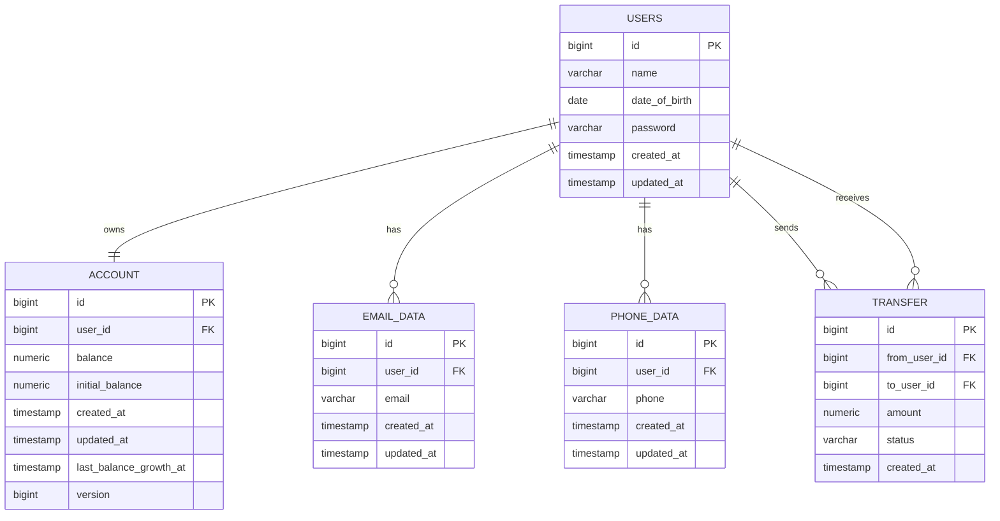

# Secure Bank API

Spring Boot REST API для тестового банковского приложения.

## Локальная база данных

Локальный PostgreSQL можно запустить командой:

```bash
docker compose up -d postgres
```

По умолчанию приложение подключается к базе по адресу:

`jdbc:postgresql://localhost:55432/banking`

Схема базы данных создается через Flyway-миграции:

`src/main/resources/db/migration`

## Схема базы данных



## Таблицы

| Таблица | Назначение |
| --- | --- |
| `users` | Пользователи банка: имя, дата рождения и BCrypt-хеш пароля. |
| `account` | Один счет на пользователя: текущий баланс, начальный баланс и технические поля для конкурентной работы. |
| `email_data` | Email-адреса пользователя. У пользователя может быть несколько email, но минимум один. |
| `phone_data` | Телефоны пользователя. У пользователя может быть несколько телефонов, но минимум один. |
| `transfer` | История денежных переводов между пользователями. |

## Отличия от исходной схемы из ТЗ

В ТЗ разрешено добавлять поля и таблицы, если это необходимо. Базовые таблицы из задания сохранены, но схема расширена техническими полями и таблицей истории переводов.

| Таблица | Добавлено | Зачем |
| --- | --- | --- |
| `users` | Название `users` вместо `user` | `USER` может конфликтовать с SQL-идентификаторами и зарезервированными словами в разных БД, поэтому используется безопасное имя `users`. |
| `users` | `created_at`, `updated_at` | Поля аудита: когда запись создана и когда последний раз обновлялась. |
| `account` | `initial_balance` | Нужен для бизнес-правила роста баланса: баланс увеличивается на 10%, но не выше `207%` от начального депозита. |
| `account` | `version` | Поле для JPA `@Version`. Переводы используют пессимистическую блокировку, но `version` остается полезной дополнительной защитой от конкурентных изменений. |
| `account` | `last_balance_growth_at` | Указатель для планировщика роста баланса. По нему приложение понимает, пора ли начислять следующий 30-секундный шаг. Если аккаунт был заблокирован переводом, он не теряет начисление и догоняется позже. |
| `account` | `created_at`, `updated_at` | Поля аудита для счета и обновлений баланса. |
| `email_data` | `created_at`, `updated_at` | Поля аудита для изменений email. |
| `phone_data` | `created_at`, `updated_at` | Поля аудита для изменений телефона. |
| `transfer` | новая таблица | Нужна для истории банковских переводов: кто отправил, кому отправил, какая сумма, статус и время операции. |

## Ограничения и индексы

Дополнительно добавлены ограничения и индексы, чтобы часть важных правил защищалась не только Java-кодом, но и самой базой данных.

| Ограничение / индекс | Зачем |
| --- | --- |
| `account_balance_non_negative` | Не дает сохранить отрицательный баланс. |
| `account_initial_balance_non_negative` | Не дает сохранить отрицательный начальный депозит. |
| `transfer_amount_positive` | Не дает сохранить перевод с нулевой или отрицательной суммой. |
| `idx_email_data_user_id` | Ускоряет загрузку email пользователя. |
| `idx_phone_data_user_id` | Ускоряет загрузку телефонов пользователя. |
| `idx_transfer_from_user_id` | Ускоряет поиск переводов по отправителю. |
| `idx_transfer_to_user_id` | Ускоряет поиск переводов по получателю. |
| `idx_account_last_balance_growth_at_user_id` | Ускоряет пакетную выборку аккаунтов, которым пора начислить рост баланса. |

## Тестовые данные

Тестовые пользователи добавляются миграцией:

`V2__insert_test_users.sql`

Для всех тестовых пользователей используется пароль:

`password123`

В базе хранится не сам пароль, а BCrypt-хеш.
