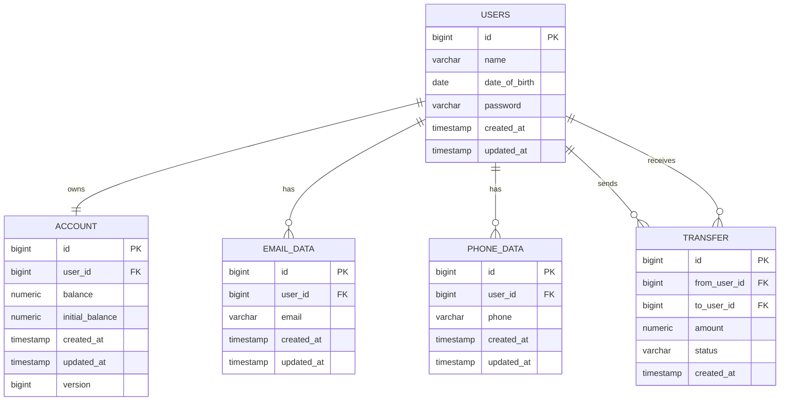

# Database Schema

The database schema is created by Flyway migrations located in:

`src/main/resources/db/migration`

## Tables

| Table | Purpose |
| --- | --- |
| `users` | Bank users with personal data and password hash. |
| `account` | One account per user with balance, initial balance, and optimistic lock version. |
| `email_data` | User email addresses. |
| `phone_data` | User phone numbers. |
| `transfer` | Money transfer history between users. |

## Seed Data

Test users are inserted by `V2__insert_test_users.sql`.

All seeded users use the password `password123`, stored as a BCrypt hash.
